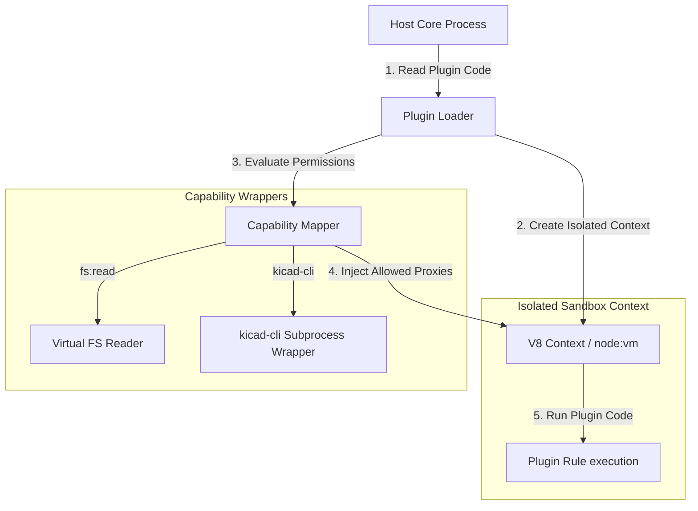

# ADR 0009: Runtime Plugin Sandboxing Mechanism

## Status

Proposed

## Context

BoardReadyOps has a plugin architecture that allows external teams to define custom rules, report formats, and adapters. 
Currently, the plugin loader (`src/core/plugin-loader.ts`) validates that loaded plugins request permissions (`PluginPermission = "fs:read" | "fs:write" | "network" | "process" | "kicad-cli"`), and checks them against the user's `boardreadyops.yml` configuration (`pluginPermissions`).

However, this is only a **declaration-level check**. Once Node.js loads a plugin via `import()`, the plugin runs with the full privileges of the host Node.js process. A buggy or malicious plugin could bypass these checks and execute arbitrary file system access, network calls, or launch external processes.

To build a enterprise-grade, secure CLI and GitHub Action, we need a **runtime sandbox** that guarantees a plugin cannot access unauthorized capabilities.

## Requirements

1. **Strict Capability Isolation:** Plugins must not have access to Node.js global modules (`fs`, `child_process`, `net`, `http`, etc.) or globals (`process`, `globalThis.fetch`, `globalThis.require`) unless explicitly granted by the user.
2. **Deterministic Context Escapes Protection:** Prevent prototype pollution or prototype constructor traversal escapes (e.g., `this.constructor.constructor('return process')()`).
3. **Low Installation Overhead:** The sandboxing mechanism must be written in pure JavaScript/TypeScript without requiring native binary modules (like C++ compiler steps for `isolated-vm`), which would break portability and complicate installation in restricted CI runners.
4. **Gradual Capability Injection:** Provide mock, wrapped, or restricted capability wrappers (e.g., a restricted read-only file system module scoped strictly to the project directory) based on granted permissions.

## Proposed Design

We propose a **Capability-Based VM Sandbox** using Node.js built-in `node:vm` module, combined with rigid context isolation:



### 1. Context Creation & Secure Globals
Instead of using standard `import()` which executes code globally, the plugin entry point is loaded as text, compiled, and executed inside a new V8 Context using `vm.createContext()` and `vm.runInContext()`.

The sandbox context starts with a clean `globalThis` containing only standard EcmaScript globals (e.g., `Object`, `Array`, `Map`, `Promise`, `Math`). Node.js-specific globals and host-bound APIs (`process`, `global`, `module`, `require`, `setTimeout`, `setInterval`) are completely omitted.

To prevent context escapes via prototype constructor traversal:
- The context's prototypes are recursively frozen using `Object.freeze()` or `Object.defineProperty()`.
- Constructor wrappers are scrubbed.

### 2. Controlled Capability Injection
Based on the granted `pluginPermissions`, the loader injects specific secure proxies into the VM context:

| Permission | Injected Global Capability | Implementation Details |
| :--- | :--- | :--- |
| **None** | Pure ES Context | Can only process mathematical/logical structures. Cannot access files, processes, or network. |
| **`fs:read`** | `fs` object (custom proxy) | Only allows calling `readFile`, `stat`, or `readdir` inside the project root workspace directory. Attempts to read absolute paths outside the workspace are rejected. |
| **`fs:write`** | `fs` object (custom proxy) | Only allows writing files inside the workspace root. Rejects write attempts to `.git` or symlinks that escape the directory. |
| **`kicad-cli`** | `kicadCli` runner proxy | Exposes a method to invoke `kicad-cli drc` or `kicad-cli erc`. Restricts running other shell binaries or commands. |
| **`network`** | `fetch` wrapper | Only permits contacting domains whitelisted in `boardreadyops.yml`. |
| **`process`** | Controlled process wrapper | Restricts accessing host environment variables (redacts secrets) and blocks process termination. |

### 3. Implementation Plan

#### Step A: Sandbox Compiler
Create a utility `src/core/sandbox.ts` that compiles and runs a JS string in a secure `node:vm` context:

```typescript
import vm from "node:vm";

export function executeInSandbox(code: string, capabilities: Record<string, any>) {
  const sandbox = {
    console: {
      log: (...args: any[]) => console.log("[Plugin]", ...args),
      error: (...args: any[]) => console.error("[Plugin]", ...args),
    },
    ...capabilities
  };
  
  const context = vm.createContext(sandbox);
  // Freeze prototype chains to prevent prototype pollution escapes
  // Execute code
  return vm.runInContext(code, context, {
    timeout: 5000, // protect against infinite loops
  });
}
```

#### Step B: Virtual File System Proxy
When `fs:read` or `fs:write` is granted, we do **not** inject the raw `node:fs` module. Instead, we write a wrapper:

```typescript
import path from "node:path";
import fs from "node:fs/promises";
import { isInside } from "../util/path.js";

export function createSandboxedFs(workspaceRoot: string, writeAllowed = false) {
  return {
    async readFile(filePath: string, encoding = "utf8") {
      const resolved = path.resolve(workspaceRoot, filePath);
      if (!isInside(resolved, workspaceRoot)) {
        throw new Error("Sandbox Violation: Access denied outside workspace.");
      }
      return fs.readFile(resolved, encoding);
    },
    // ... similarly restrict write, stat, readdir
  };
}
```

#### Step C: Loader Integration
Update `src/core/plugin-loader.ts` to read the plugin file contents and run it via `executeInSandbox` rather than `import(entrypoint)`.

## Consequences

- **Security:** Highly secure execution of third-party plugins in local environments and shared CI runners.
- **Portability:** Written in pure Node.js/TypeScript without requiring node-gyp native compilations.
- **Performance:** Slight compilation latency (~2-5ms) during plugin initialization, which is negligible for CLI execution.
- **Limitation:** Plugins must be written to use the injected sandboxed globals instead of direct `import "node:fs"` statements. To support ES Modules, we can transpile the plugin or instruct authors to use injected capabilities (e.g., accessing file systems through a parameter passed to the rule run function).
