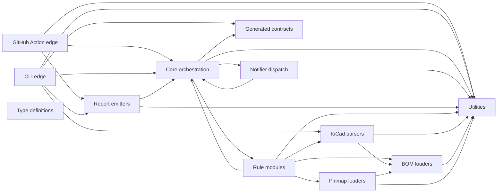

# Architecture

The pipeline loads configuration, discovers KiCad projects, runs registered rules, normalizes findings, and emits reports. Rule modules are closed in v1 and use stable identifiers.

## Layered Source Layout

BoardReadyOps keeps runtime edges, orchestration, rule implementations, parsers, and output formatting in separate source layers. The layer contract is enforced by `pnpm run verify:structure`, which scans TypeScript source imports and fails on disallowed dependencies or import cycles.

## Enforced Rules

The structure check enforces these constraints:

- `src/action` and `src/cli` are runtime edges. They may call core orchestration, reports, and shared helpers that are needed at the boundary.
- `src/core` owns orchestration and may call generated contracts, registered rules, notifier dispatch, and utilities.
- `src/notifiers` owns best-effort notification delivery. It may consume core finding/config types and utilities, but notifier failures must not block pipeline results.
- `src/rules` may use core types plus the BOM, KiCad, pinmap, and utility layers needed to evaluate hardware checks.
- `src/report` consumes core results and formats output. It does not import rule implementations.
- `src/bom`, `src/kicad`, and `src/pinmap` stay parser-focused. Their cross-layer imports are limited to the parser dependencies encoded by the structure verifier.
- `src/util` and `src/generated` are leaf dependencies. `src/types` is reserved for ambient declarations and is not a shared import target unless the verifier is updated with an explicit dependency edge.
- Source imports must remain acyclic.
- `src/index.ts` is not a public v1 entrypoint.
